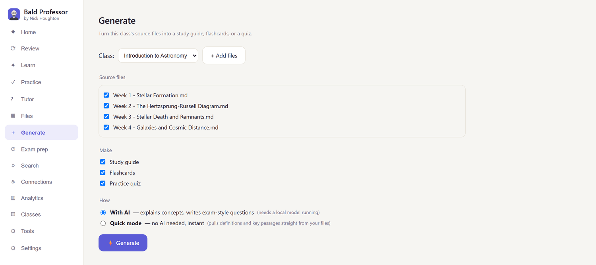
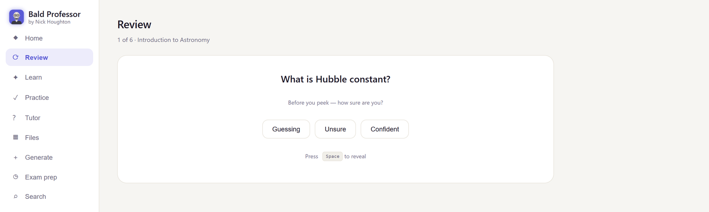
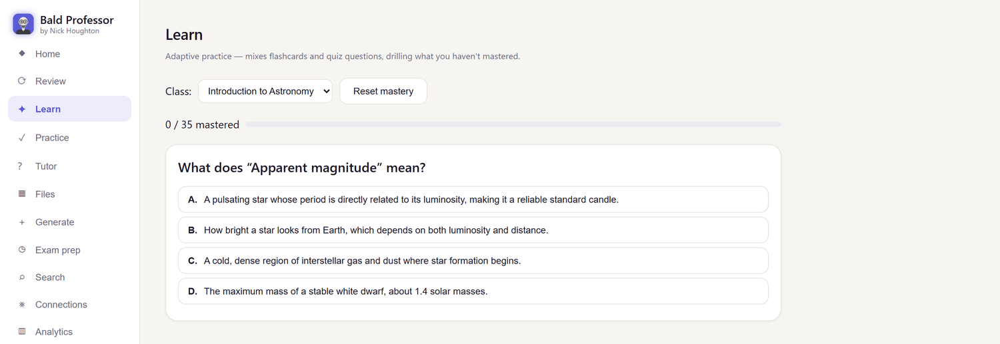
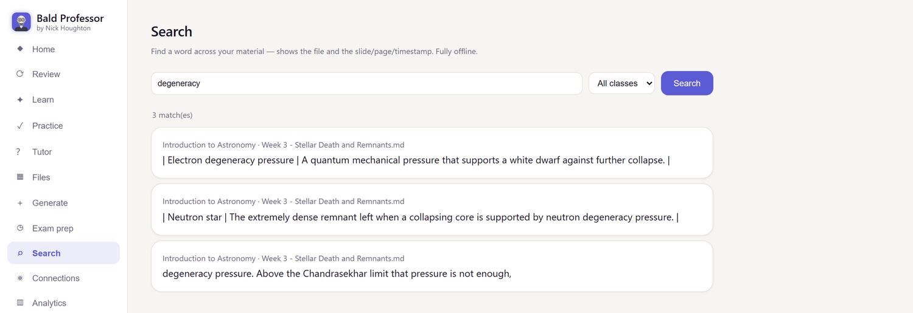
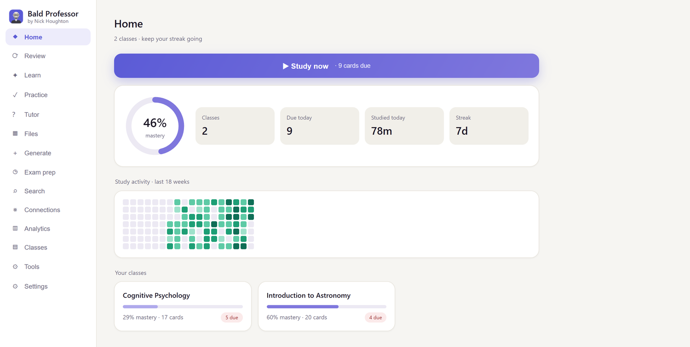

# 📚 Bald Professor


**A free, offline study coach for Windows and macOS.**

Drop a course's material into a folder. PDFs, slides, Word documents, notes,
photos of handwritten pages, even lecture recordings. Bald Professor turns them
into study guides, flashcards, scored quizzes, practice exams, spaced repetition,
and a tutor that answers from *your own* files and cites the page it used.

**No account. No subscription. No cloud.** It works out of the box with no AI
model at all. Add a local model, or connect an assistant you already pay for,
whenever you want richer material.

> This is the download page. Bald Professor is free for personal use. See the
> [licence](LICENSE.txt). It is not open source.

## Why this and not a chatbot

Most study tools want your coursework on their servers. This one does not want
anything from you at all.

- **Your material never leaves your computer.** Quick mode and a local model are
  fully offline. Nothing is uploaded, nothing is logged, nothing phones home.
- **No account to create**, so nothing to cancel and no data to delete later.
- **Your work is just files.** Classes are ordinary folders on your disk, and
  flashcards export to Anki, so nothing is trapped inside the app.
- **Real spaced repetition.** FSRS, the algorithm modern Anki uses, scheduling
  each card for the moment you are about to forget it.
- **No quotas and no rug pull.** It is a program on your machine. It cannot be
  throttled, renamed, or discontinued out from under you.

## What it looks like

Make a class, tick your files, and choose how it is built. **Quick mode** needs no
model at all.



Flashcards go straight into spaced repetition. It asks how sure you are before it
shows the answer, because guessing right and knowing are not the same thing.



Learn mixes flashcards and quiz questions and keeps drilling whatever you have not
mastered. The wrong answers are pulled from other real definitions in your own
material, so the questions are not giveaways.



Search reads every file you have added and shows the exact page, slide or
timestamp. Fully offline.



The dashboard tracks how far through each course you actually are. The ring is
your overall mastery, each class carries its own completion bar, and the heatmap
fills in as the weeks go by, so you can see the growth rather than guess at it.



*(Screenshots use an invented Astronomy course, not anyone's real coursework.)*

## Download

Grab the latest build from the **[Releases](../../releases)** page:

| Platform | File |
|---|---|
| **Windows**, installer (recommended) | `BaldProfessor-Windows-Setup.exe` |
| **Windows**, portable, no install | `BaldProfessor-Windows-Portable.zip` |
| **macOS**, Apple Silicon (M1 to M4) | `BaldProfessor-Mac-AppleSilicon.dmg` |
| **macOS**, Intel | `BaldProfessor-Mac-Intel.dmg` |

**Not sure which Mac you have?** Apple menu, *About This Mac*. If the chip line
says **Apple M** something, take Apple Silicon. If it says **Intel**, take Intel.
The two builds are not interchangeable.

**Windows.** The installer is per user, so it needs no administrator rights. If
you took the portable zip, unzip it anywhere and run `BaldProfessor.exe`.

**macOS.** Open the `.dmg` and drag **Bald Professor** into Applications. A `.zip`
is also attached if you would rather not use a disk image.

Either way your classes and settings live in your own user folder, so updating or
reinstalling never touches them.

## Setup

**There isn't any.** Install it, open it, make a class, drop your files in, and
click Generate. **Quick mode** builds flashcards, a study guide and a quiz
straight from your files with no AI model, no downloads and no account.

Everything else, including spaced repetition, adaptive Learn, scored quizzes,
search and analytics, works offline too.

### Want better material? Add an AI (optional)

Quick mode pulls out definitions and key passages, but it cannot *explain* things
or write exam style questions. For that, pick one:

**Option A. A local model, which stays on your computer.**

1. Install [Ollama](https://ollama.com).
2. Run `ollama pull gemma3:4b`. About 3 GB, handles text *and* photos of
   handwritten notes, comfortable on any 16 GB laptop. With 32 GB or more,
   `gemma3:12b` is better. Set it in Settings.

[LM Studio](https://lmstudio.ai) works just as well. Bald Professor finds
whichever one is running and lists the models it has loaded, so you never have to
know about ports or config files.

**Option B. Use Claude, or any assistant you already pay for.**

This gives the best material and there is nothing extra to install. Full
instructions are in the next section.

### Staying up to date

Bald Professor can tell you when a newer version is out. It is **off by default**,
because the whole point of this app is that it does not phone home. Turn it on in
**Settings**, *Check for updates*, or press **Check now** whenever you feel like
it. When enabled it asks GitHub once a day and sends nothing about you or your
files.

**Updating keeps everything.** Your classes, review history, streaks and settings
live in your own user folder, not inside the app, so installing a new version
never touches them.

> **Privacy.** Quick mode and a local model never send anything anywhere. Option B
> does, because your assistant receives whatever files it reads. Both AI options
> are off until you set them up.

The app checks your setup (**Tools**, *Run setup check*) and tells you in plain
language if anything is missing, including whether your chosen model is too big
for your machine's memory.

## Use Claude with Bald Professor (MCP)

Already paying for Claude, ChatGPT or Gemini? You can point it straight at your
classes instead of running a second model. Your assistant reads your course files
and writes flashcards, study guides and quiz banks **back into the app**, where
they enter spaced repetition like anything else.

This uses **MCP**, an open standard for connecting assistants to local tools.
Bald Professor is already an MCP server. There is nothing to install and no
Python needed.

### Step 1. Find where Bald Professor is installed

You need the full path to the program itself.

- **Windows, installer:**
  `C:\Users\YOU\AppData\Local\Programs\Bald Professor\BaldProfessor.exe`
- **Windows, portable:** wherever you unzipped it, ending in `BaldProfessor.exe`
- **macOS:** `/Applications/Bald Professor.app/Contents/MacOS/BaldProfessor`

> **Mac users, this one catches people out.** A `.app` is really a folder. You
> must point at the program *inside* it, which is the long path above, not at
> `Bald Professor.app`.

### Step 2. Add it to your assistant

**Claude Desktop.** Open *Settings*, *Developer*, *Edit Config*, and paste this,
replacing the path with your own:

```json
{
  "mcpServers": {
    "bald-professor": {
      "command": "/Applications/Bald Professor.app/Contents/MacOS/BaldProfessor",
      "args": ["--mcp"]
    }
  }
}
```

On Windows the `command` line looks like this instead. Use **forward slashes**,
because JSON treats a backslash as an escape character:

```json
      "command": "C:/Users/YOU/AppData/Local/Programs/Bald Professor/BaldProfessor.exe",
```

**Claude Code.** One line in a terminal:

```bash
claude mcp add bald-professor -- "/Applications/Bald Professor.app/Contents/MacOS/BaldProfessor" --mcp
```

### Step 3. Leave Bald Professor open, then restart your assistant

**Bald Professor must be running.** Everything your assistant writes goes through
the open app, which is what stops two things editing your review history at once.

Restart the assistant and the Bald Professor tools appear.

### Step 4. Just ask

> *"Look at my Statistics class in Bald Professor, read the source files, and make
> me 15 flashcards on the parts I am most likely to be examined on."*

> *"What have I got due in Bald Professor today? Quiz me on the cards one at a
> time and tell me where I am weak."*

### About the port

Bald Professor runs a small web server on your own machine at
**`http://127.0.0.1:8765`**. That address is local only. It is not reachable from
the internet, or from anywhere else on your network.

If something else is already using 8765, the app quietly takes the next free port,
**up to 8776**, and the MCP connection checks that whole range. Normally you do
not have to think about it at all.

Only if you have moved it somewhere unusual, set the `BALDPROF_URL` environment
variable, for example `http://127.0.0.1:9000`.

### What your assistant can do

| Tool | What it does |
|---|---|
| `list_classes` | See your classes and how many cards each has |
| `list_sources` | List the source files in a class |
| `read_source` | Read the text of one of your files |
| `search_material` | Find a fact without reading whole documents |
| `add_flashcards` | Write cards into a class, straight into review |
| `save_study_guide` | Save a study guide |
| `create_question_bank` | Build a scored quiz for the Practice tab |
| `get_due_cards` | See what is due right now |
| `get_progress` | Streak, due counts and per class totals |

### If it does not work

- **"Can't find Bald Professor"** means the app is not running. Open it and leave
  it open.
- **No tools appear?** The path must be absolute, and on macOS it must point
  inside the `.app` as described in Step 1.
- **Cards went to the wrong class?** Class names must match exactly. Ask the
  assistant to run `list_classes` first.

> **Remember what this costs you in privacy.** This is the one option that sends
> your material off your computer, to whichever assistant you connect. Quick mode
> and a local model never do. If your coursework is confidential, stay on those.

## A note on security warnings

The app is not code signed with a paid certificate, so your system will warn you
the first time. This is expected for independent software and it only happens
once.

**Windows.** SmartScreen shows "Windows protected your PC". Click **More info**,
then **Run anyway**.

**macOS.** You will be told the app is from an unidentified developer. Open
**System Settings**, **Privacy & Security**, scroll to the message about Bald
Professor, and click **Open Anyway**.

Every release lists the SHA-256 of each file, so you can check that what you
downloaded is what was published.

## What it does

- **Generate** study guides, flashcards and quizzes from your files, with or
  without AI.
- **Review** with spaced repetition that remembers exactly when to show each card.
- **Learn** adaptively, drilling whatever you keep getting wrong.
- **Practice** with scored, timed quizzes and weak topic tracking.
- **Tutor**, grounded question and answer over your files, citing the exact page,
  slide or timestamp.
- **Exam prep**, mock exams, study plans and certification mode.
- **Export to Anki**, because your flashcards should outlive this app.
- Plus Connections across courses, analytics, search and backups.

## Privacy

**Offline by default.** Out of the box, and with a local model, your class
materials and study data never leave your computer. There is no account, no
telemetry and no cloud storage. Your classes are just folders on your disk.

Two things can send data out, and **both are off until you turn them on**:

- **Connecting an assistant over MCP**, which receives whatever course files it
  reads.
- **Web fetch**, pulling a public page into a class. Restricted to public http and
  https, blocks private and local addresses, and asks before every fetch.

## Support and feedback

Open an issue on this repo. Bug reports and feature ideas are welcome. The source
is private, but I read everything.
